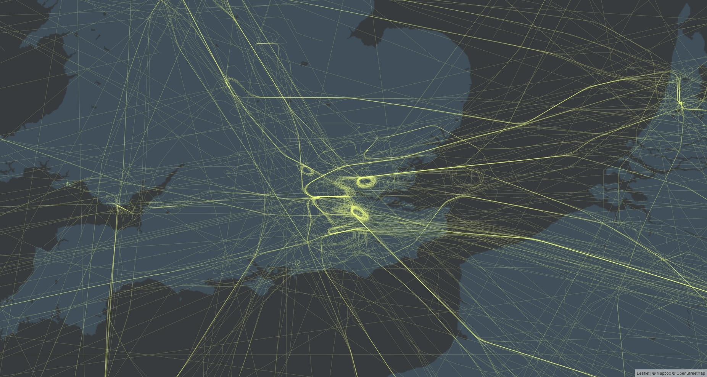

# Traffic Management Tool for VATSIM
## What is it?
It's my attempt at making something to help manage traffic as an ADC/Area coordinator. Right now, it doesn't do any of that stuff, but it does draw pretty maps. 

# How can I use it?
## Installing
It's built in ``nodejs``, so for starters you'll need to go install the latest version of that from https://nodejs.org/en/download/

Then:
- Clone this repository to a folder
- Run ``npm install`` in the repository folder using your terminal of choice. This will install the dependencies of the app
- That's all of the installation that is required!

## Usage
### Collecting data from the VATSIM datafeed
- Run ``npm run watch``

### Making pretty maps
- The construction of pretty maps is dependent on two things:
    - Data - this comes from the datafeed, so you need to collect some before trying to use it
    - A Mapbox API token
        - Get this at https://mapbox.com/ - it should look something like ``pk.xxxxxxxxxxxxxxxxxxxxxxxxxxxxxxxxxxxxxxxx``. 
        - Put it in ``config.js`` as ``mapboxToken``
- Run ``npm run server``
- Navigate to ``localhost:8080`` to find the maps server. 

Once you have the server running, here's a list of things you can do
#### Heat map
- ``http://localhost:8080/map/all/heat``
- (it's a really bad heatmap, because all heatmaps are bad)

#### Flight line map
- ``http://localhost:8080/map/all``
- It's an actually nice line map, and looks like the screenshot above